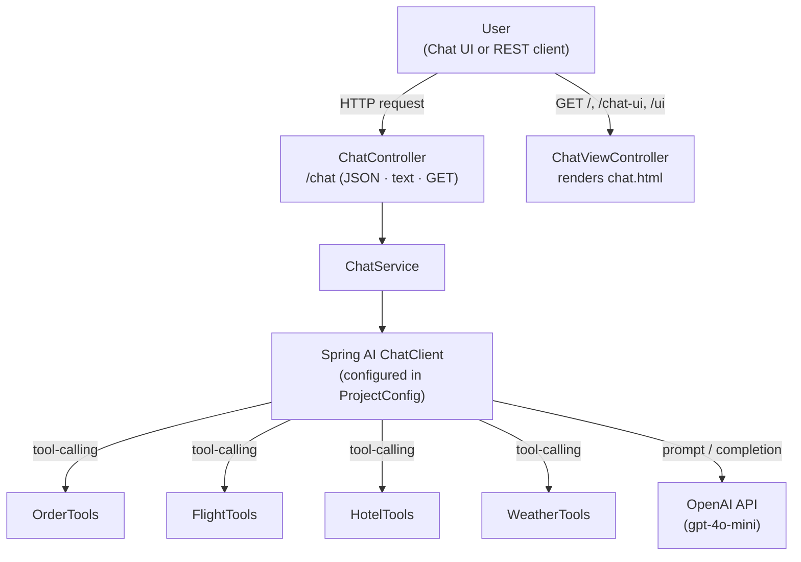

# 🤖 Ai-Agent-Backend

**A Spring Boot–powered AI agent backend with real tool-calling — order management, flight & hotel search, and weather, all wired into an OpenAI-driven chat assistant with its own web console.**

<p>
  
  
  
  
  
  
</p>

---

## 📑 Table of Contents

- [Overview](#-overview)
- [Features](#-features)
- [Tech Stack](#-tech-stack)
- [Architecture](#-architecture)
- [API Endpoints](#-api-endpoints)
- [Getting Started](#-getting-started)
- [Configuration](#-configuration)
- [Screenshots](#-screenshots)
- [Roadmap](#-roadmap--future-improvements)
- [Author](#-author)

---

## 🧭 Overview

**Ai-Agent-Backend** is a personal AI assistant service built on **Spring Boot** and **Spring AI**. It exposes a conversational agent — *"Ishan's AI"* — that understands natural-language requests and autonomously calls backend tools to answer them: checking an order's status, cancelling an order, searching flights or hotels, or fetching a weather forecast.

The project ships with two ways to talk to the agent:

- 🖥️ **A built-in chat console** — a Thymeleaf + Tailwind CSS single-page UI with light/dark themes, served directly by the backend.
- 🔌 **A REST API** — JSON, plain-text, and query-param endpoints for integrating the agent into any client.

> This is a learning / portfolio project demonstrating **function-calling (tool use) with LLMs** in a real Spring Boot service, rather than a production travel-booking system — flight, hotel, and order data are currently in-memory sample datasets.

---

## ✨ Features

| Category | Capability |
|---|---|
| 🧠 **Conversational agent** | Natural-language chat backed by OpenAI `gpt-4o-mini` via Spring AI's `ChatClient` |
| 🛠️ **Tool calling** | The model autonomously invokes Java methods (`@Tool`) to fetch real data instead of guessing |
| 📦 **Order management** | Look up order status, cancel an order, get total order count |
| ✈️ **Flight search** | Query flights by source, destination, and date |
| 🏨 **Hotel search** | Query hotels by city and maximum nightly price, with ratings |
| 🌦️ **Weather forecast** | Get a forecast for a city and date |
| 🌐 **Multi-format API** | Same `/chat` endpoint accepts JSON, plain text, or query parameters |
| 🎨 **Web chat console** | Responsive dark/light UI with a "classic" typographic theme, served at `/` |

---

## 🧱 Tech Stack

- **Language:** Java 21
- **Framework:** Spring Boot 4.1.1 (`spring-boot-starter-webmvc`, `spring-boot-starter-thymeleaf`)
- **AI orchestration:** Spring AI 2.0.1 (`spring-ai-starter-model-openai`)
- **LLM provider:** OpenAI (default model: `gpt-4o-mini`, configurable)
- **Frontend:** Thymeleaf templates + Tailwind CSS (CDN), vanilla JS
- **Boilerplate reduction:** Lombok
- **Build tool:** Maven (with Maven Wrapper — no local Maven install required)
- **Testing:** Spring Boot Test (`spring-boot-starter-test`)

---

## 🏗️ Architecture



**Flow:** a request hits `ChatController`, which delegates to `ChatService`. The service calls the Spring AI `ChatClient`, which is pre-configured (in `ProjectConfig`) with a system prompt and four registered tools. The model decides, per request, whether to answer directly or call one or more tools before responding — the tool results are fed back into the conversation automatically by Spring AI.

**Package layout:**

```
com.ishan.agent.backend
├── config/       → ChatClient + tool wiring (ProjectConfig)
├── controller/    → ChatController (REST), ChatViewController (web UI)
├── dto/           → ChatRequest, ChatResponse
├── model/         → Flight, Hotel
├── service/       → ChatService
└── tools/         → OrderTools, FlightTools, HotelTools, WeatherTools
```

---

## 🔌 API Endpoints

All endpoints are exposed under `/chat`.

| Method | Path | Content-Type | Description |
|---|---|---|---|
| `POST` | `/chat` | `application/json` | Send `{ "message": "..." }`, receive `{ response, success, timestamp }` |
| `POST` | `/chat` | `text/plain` | Send a raw text message, receive a plain-text reply |
| `GET` | `/chat?message=...` | — | Query-param based chat (also accepts `query` / `param`) |
| `GET` | `/`, `/chat-ui`, `/ui` | `text/html` | Serves the interactive chat console |

<details>
<summary><strong>Example — JSON request</strong></summary>

```bash
curl -X POST http://localhost:8081/chat \
  -H "Content-Type: application/json" \
  -d '{"message": "Find me a flight from Delhi to Goa on 2026-08-21"}'
```

```json
{
  "response": "IndiGo : $ 4200, Air India : $ 5600, SpiceJet : $ 3900",
  "success": true,
  "timestamp": "07:42 PM"
}
```
</details>

<details>
<summary><strong>Example — plain-text / GET request</strong></summary>

```bash
curl "http://localhost:8081/chat?message=What%27s%20the%20weather%20in%20Goa%20tomorrow%3F"
```
</details>

---

## 🚀 Getting Started

### Prerequisites

- **Java 21** (JDK)
- An **OpenAI API key**
- No local Maven install needed — the project includes the Maven Wrapper (`mvnw`)

### Run locally

```bash
# 1. Clone the repository
git clone https://github.com/ishanranjan08/Ai-agent-Backend.git
cd Ai-agent-Backend

# 2. Set your OpenAI API key
export OPENAI_API_KEY=your_api_key_here

# 3. Run the app
./mvnw spring-boot:run
```

The service starts on **http://localhost:8081**. Open it in a browser to use the chat console, or call `/chat` directly as shown above.

### Run tests

```bash
./mvnw test
```

---

## ⚙️ Configuration

Configuration lives in `src/main/resources/application.yml`:

```yaml
server:
  port: 8081

spring:
  application:
    name: ai-agent-backend
  ai:
    openai:
      api-key: ${OPENAI_API_KEY}
      chat:
        model: ${CHAT_MODEL:gpt-4o-mini}
```

| Variable | Required | Default | Purpose |
|---|---|---|---|
| `OPENAI_API_KEY` | ✅ Yes | — | Your OpenAI API key |
| `CHAT_MODEL` | ❌ No | `gpt-4o-mini` | Overrides the chat model used |

> ⚠️ Never commit a real API key. Keep `OPENAI_API_KEY` in your shell environment, a local `.env` (git-ignored), or your deployment platform's secret store.

---

## 🖼️ Screenshots

> _Add real screenshots of the chat console here for a stronger, recruiter-friendly first impression._

| Chat Console (Dark) | Chat Console (Light) |
|---|---|
| `` | `` |

---

## 🗺️ Roadmap / Future Improvements

- [ ] Persist orders, flights, and hotels in a real database instead of in-memory data
- [ ] Add authentication/authorization for the chat and REST endpoints
- [ ] Add booking (not just search) for flights and hotels
- [ ] Add conversation history / memory across turns
- [ ] Containerize with Docker and add CI/CD (GitHub Actions)
- [ ] Add OpenAPI/Swagger documentation for the REST API
- [ ] Expand automated test coverage for tools and services

---

## 👤 Author

**Ishan Ranjan**
GitHub: [@ishanranjan08](https://github.com/ishanranjan08)

---

<p align="center"><em>⭐ If you found this project interesting, consider starring the repo!</em></p>
